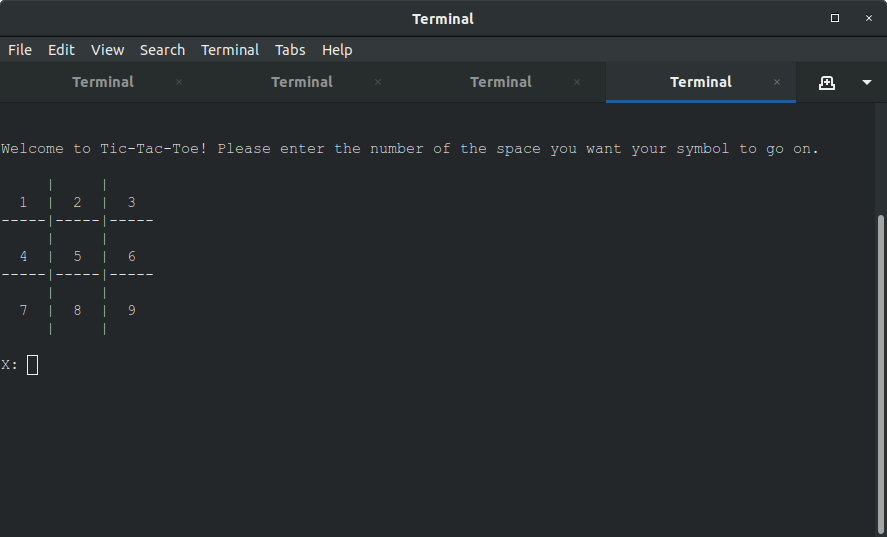

# tic_tac_toe

An interactive terminal-based tic-tac-toe game based in Ruby.

Installation
  * Prerequisite: a working Ruby interpreter. Visit `https://www.ruby-lang.org/en/documentation/installation/` for instructions on installing Ruby.
  * Clone the repo at `https://github.com/celloward/tic_tac_toe`

Usage
  * Navigate to the cloned directory.
  * To run the program, type into the terminal:
    `ruby lib/tic_tac_toe.rb`
  * Each human player takes turns at their symbol prompt and enters the number of the space they want their symbol to occupy. 
  * The program ends when someone wins or when there is a draw.

Testing
  * To create unit tests, open `spec/tic_tac_toe_spec.rb` and add the tests using the rspec syntax.
  * To run tests, type `rspec` into the root project directory.

Acknowledgement
  * Code review by Tim Macdonald.